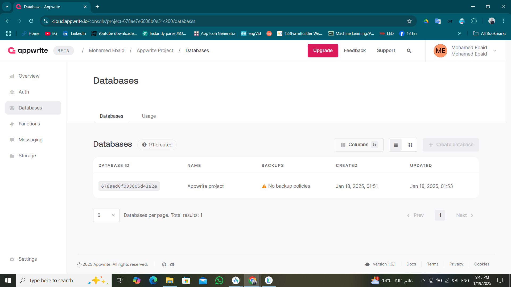
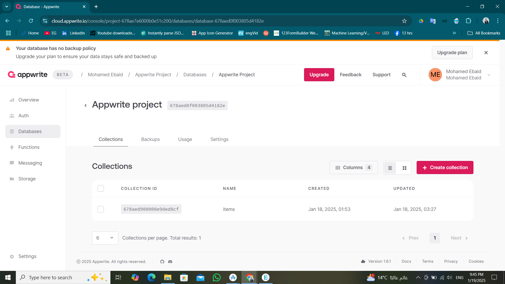
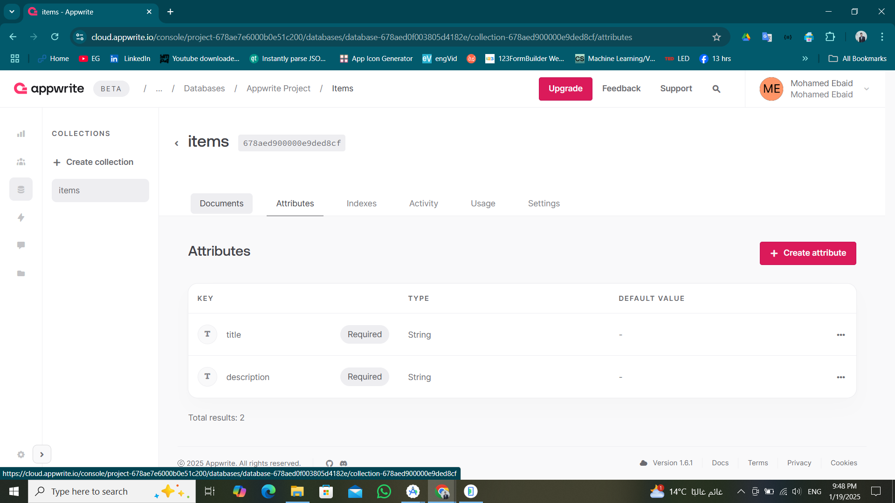
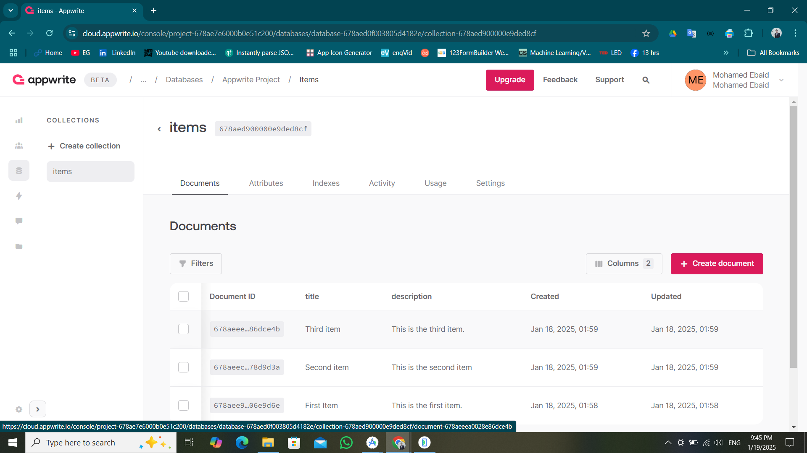
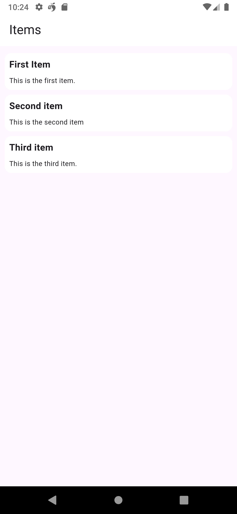

git add README.md# appwrite_project
# Appwrite
# Flutter App with Appwrite Integration

A basic Flutter application that fetches and displays a list of items from an Appwrite backend. Users can load data by pressing a button, and the app seamlessly integrates with the Appwrite platform.

## Features
- Fetch and display data from Appwrite.
- Simple and user-friendly UI.
- Integration with Appwrite for backend services.
- Responsive and well-structured Flutter codebase.

# Backend Setup Documentation

## Overview
The backend for this project uses Appwrite to manage and retrieve data. This setup includes a database with a collection named `Items`.

## Collection Structure
- **Database Name:** `Appwrite Project`
- **Collection Name:** `Items`
- **Fields:**
    1. `title` (String): The title of the item.
    2. `description` (String): A short description of the item.

## API Endpoints
The following Appwrite SDK function is used to fetch data:
##dart

final response = await _database.listDocuments(
databaseId: '678aed0f003805d4182e',
collectionId: '678aed900000e9ded8cf',
);

## Appwrite Configuration Screenshots

## Database

### Collection

### attributes

### Sample Data

## Screenshots

## Voice Note

